## Table of Contents
---
1. [Flow Chart](#Flow%20Chart)
2. [Sequence Diagram](#Sequence%20Diagram)
3. [Class Diagram](#Class%20Diagram)
4. [State Diagram](#State%20Diagram)
5. [Entity Relationship Diagram](#Entity%20Relationship%20Diagram)
6. [User Journey](#User%20Journey)
7. [Gantt](#Gantt)
8. [Pie Chart](#Pie%20Chart)
9. [Quadrant Chart](#Quadrant%20Chart)
10. [Requirement Diagram](#Requirement%20Diagram)

## Flow Chart
---
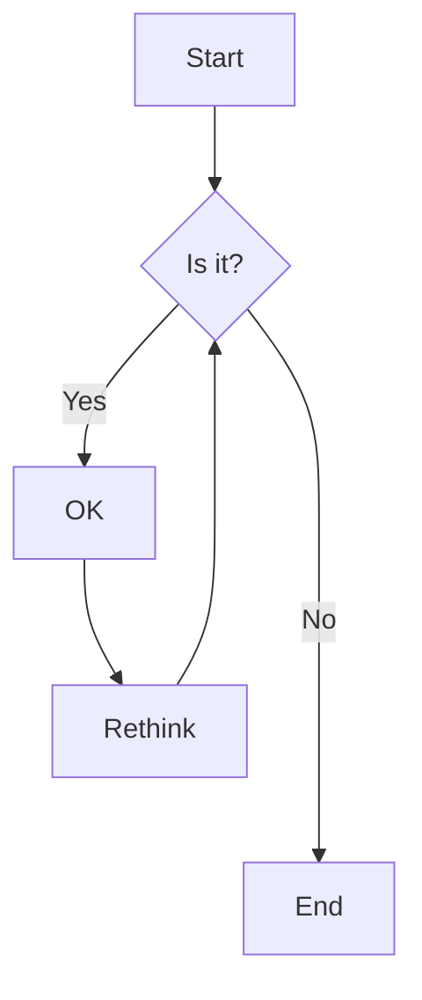

## Sequence Diagram
---
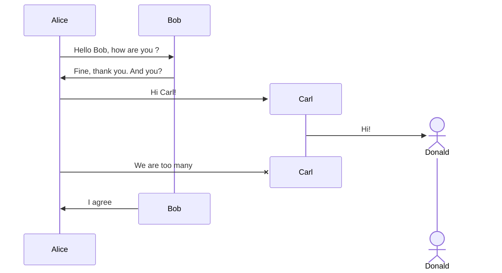

## Class Diagram
---
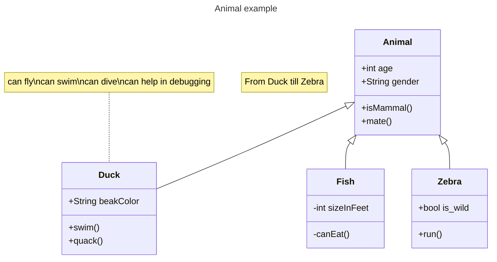

## State Diagram
---
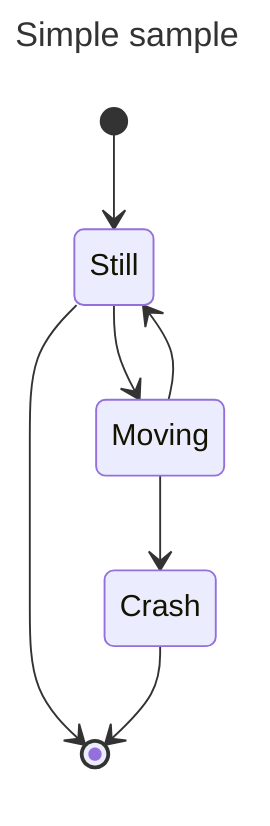

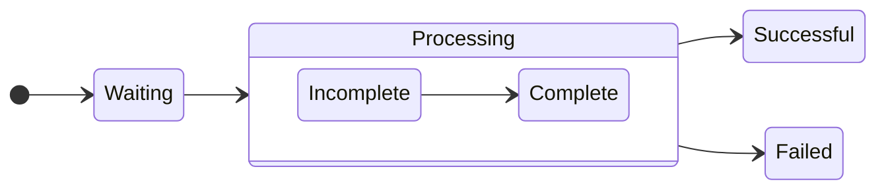

## Entity Relationship Diagram
---
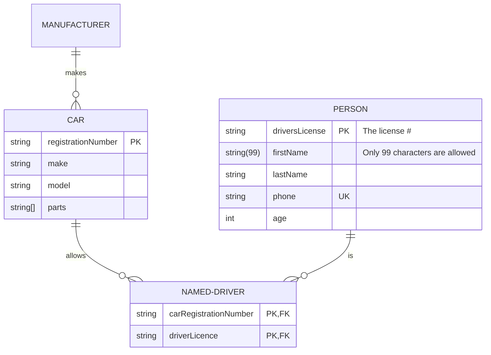

## User Journey
---
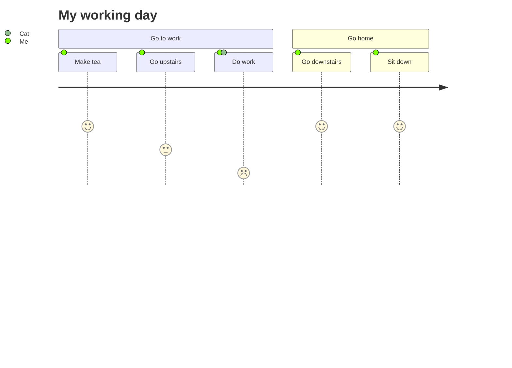

## Gantt
---
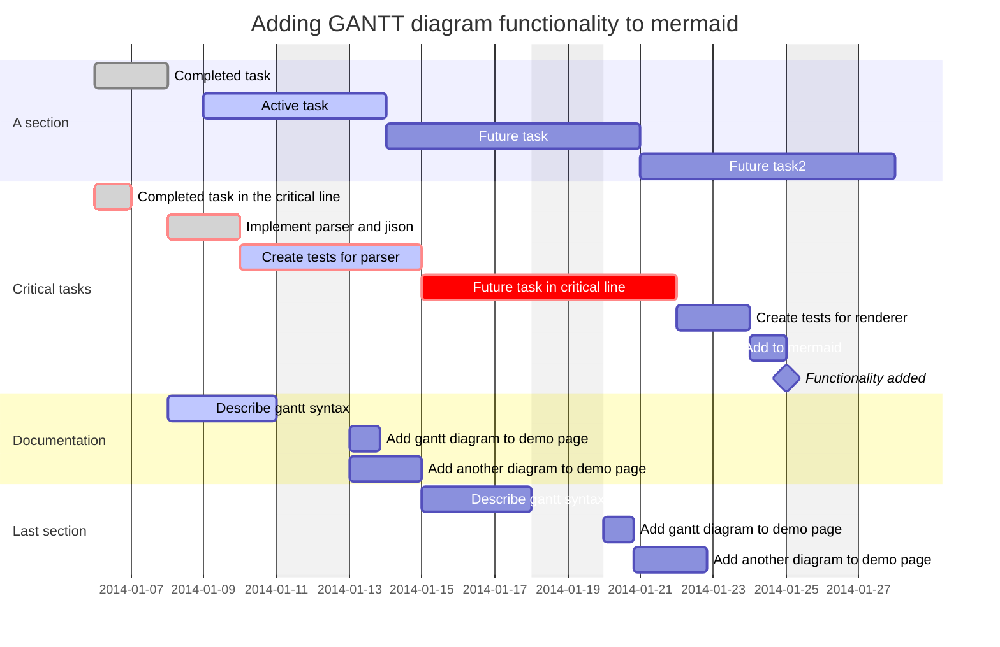

## Pie Chart
---
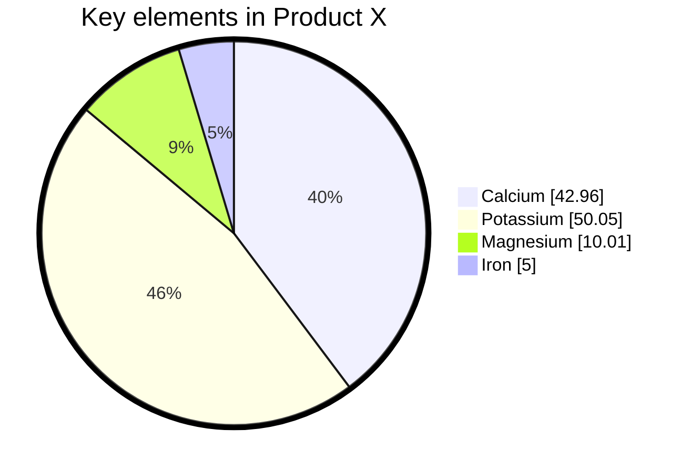

## Quadrant Chart
---
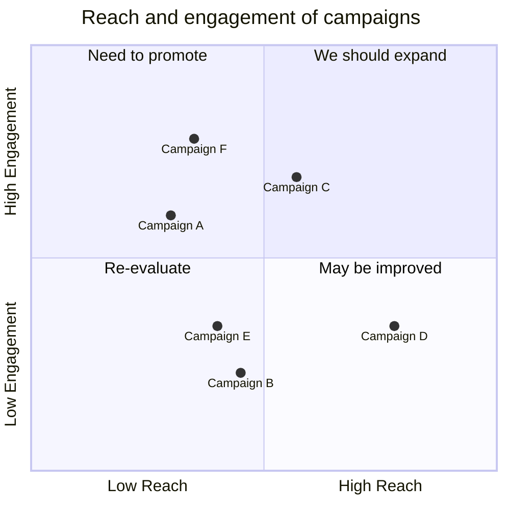

## Requirement Diagram
---
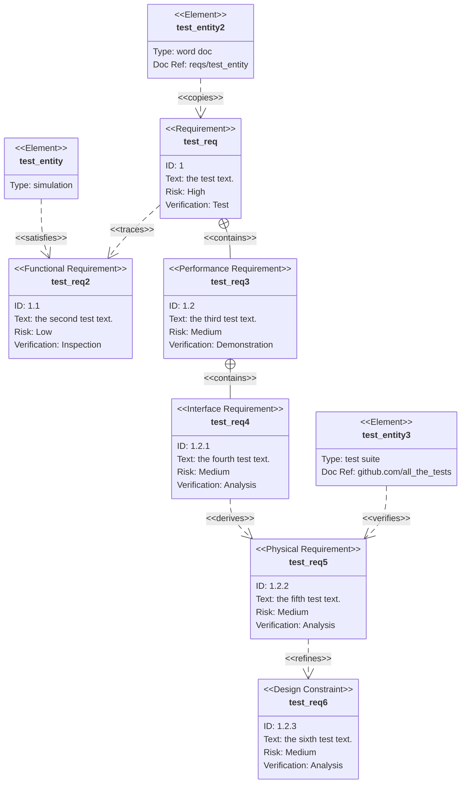

